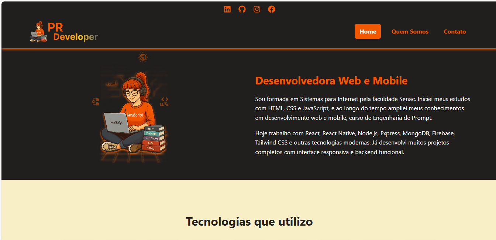

# Portfólio da Priscila Ramonna

## Sobre o Projeto

Este é meu portfólio pessoal desenvolvido com React e outras tecnologias web modernas. Nele, apresento minhas habilidades como desenvolvedora web e mobile, meus projetos, experiência e contato.

## Link para o projeto online: [https://priscilaramonna.netlify.app](https://priscilaramonna.netlify.app)

---

## Tecnologias Utilizadas

- React
- React Router
- CSS3 / Flexbox / Media Queries
- React Icons
- Netlify (deploy)

---

## Como Rodar Localmente

 Clone o repositório
git clone <https://github.com/Princyrr/minhapage.git>

 Entre na pasta do projeto
cd nome-do-projeto

 Instale as dependências
npm install

 Rode o projeto localmente
npm start

## 📱 Contato

LinkedIn:  https://www.linkedin.com/in/priscila-pires-171617128/

GitHub:    https://github.com/Princyrr

Instagram: https://www.instagram.com/priscilarpiress

## Desenvolvido com 💜 por Priscila Ramonna
